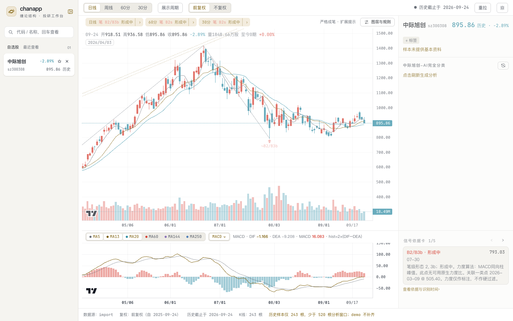

# chanapp

个人缠论分析 Web 应用。用 K 线图查看笔、线段、中枢与买卖点，并对照多周期分析结果。



离线 demo，使用随包历史样本。图中行情不实时更新。

- 查看 30 分、60 分、日线和周线。A 股个股可切换前复权与不复权。
- 选择严格／宽松成笔、标准／扩展提示，查看依据卡与多周期共振摘要。
- 使用 MACD、KDJ、RSI、BOLL 副图、自选与标签、搜索查看记录和日夜主题。
- 在页面勾选展示周期。在线模式下可手动触发 AI 联合分析，需要自备模型服务 key。

## 选择使用方式

| 我想做什么 | 从这里开始 | 是否需要在线来源凭据 |
| --- | --- | --- |
| 先看看应用 | [用随包样本运行离线 demo](#离线-demo) | 不需要 |
| 查看自己的历史数据 | [导入 CSV](#导入自己的历史数据) | 不需要，在 demo 模式查看 |
| 持续更新行情 | [配置真实模式](#真实模式在线来源) | 需要两个市场所选来源的凭据 |

`demo` 是离线运行模式，既能查看随包样本，也能查看自己导入的历史数据。`real` 是在线运行模式，按交易时段更新数据。项目不代供在线数据。

## 安装

需要 Python 3.12 和 macOS 或 Linux。Windows 不支持。先克隆或下载仓库，再进入仓库根目录运行：

```bash
python3.12 -m venv .venv
.venv/bin/pip install -r requirements.txt
```

## 离线 demo

先完成安装。运行前确认当前终端没有设置 `CHANAPP_INSTANCE_CONFIG`、`CHANAPP_CACHE_DIR`、`WATCHLIST_PATH`、`VIEW_LOG_PATH`、`ANALYSIS_CACHE_DIR`。

```bash
.venv/bin/python -m chanapp.engine.kline.seed_demo .cache/demo
CHANAPP_INSTANCE_CONFIG=.cache/demo/instance.json .venv/bin/python -m uvicorn chanapp.api.main:app --host 127.0.0.1 --port 8899
```

保持这个终端运行，在浏览器打开 <http://127.0.0.1:8899/>。默认显示中际旭创；搜索上证指数可将它加入自选。状态栏显示「历史截止于某日」，表示正在查看离线历史。

demo 不联网，也不调用 AI。随包样本不足 520 根分析窗口，页面会提示且不补齐；没有港股、F10、资金流与 AI 样本。样本范围、校验与重复初始化规则见 [随包 demo 的初始化](docs/data-contract.md#随包-demo-的初始化)。

## 导入自己的历史数据

先完成安装，再按 [导入并查看完整示例](docs/data-contract.md#例子导入并查看) 创建独立实例、准备 CSV、导入数据并打开页面。使用 demo 模式即可，不需要在线来源凭据。

准备自己的文件时，核对 [CSV 文件格式](docs/data-contract.md#文件格式) 和 [处理规则](docs/data-contract.md#处理规则)。

## 真实模式（在线来源）

先完成安装，并自行开通所选在线来源。**当前两个市场的来源凭据都必须齐全，即使只看 A 股。** 缺少凭据时，应用拒绝启动。已适配来源与限制见 [支持清单与限制](docs/support-and-limits.md#数据来源)。

1. 按 [真实模式实例](docs/configuration.md#真实模式实例) 创建 `.cache/real/instance.json`。
2. 按 [来源凭据](docs/configuration.md#来源凭据) 在启动终端设置所选来源的环境变量。凭据不要写进实例配置或仓库。
3. 按 [启动说明](docs/operations.md#启动) 运行应用，将配置路径替换为 `.cache/real/instance.json`。保留回环监听地址，并检查运行状态。

## 按任务查文档

| 我想做什么 | 读这里 |
| --- | --- |
| 修改实例配置或数据目录 | [配置字段](docs/configuration.md#字段与合法值)、[数据路径](docs/configuration.md#实例目录与数据路径) |
| 选择展示周期或理解分析结果 | [展示周期与分析](docs/periods-and-analysis.md)、[形成中的点位](docs/periods-and-analysis.md#形成中的点位) |
| 配置 AI | [模型环境变量](docs/configuration.md#环境变量)、[分析周期组合](docs/periods-and-analysis.md#共振与-ai-的周期组合) |
| 判断是否适合自己的使用场景 | [支持清单](docs/support-and-limits.md#支持清单)、[默认额度估算](docs/support-and-limits.md#默认额度能支撑多少自选)、[已知限制](docs/support-and-limits.md#已知限制) |
| 部署、备份或排查更新状态 | [部署与更新](docs/operations.md#部署与更新)、[备份](docs/operations.md#备份)、[状态检查](docs/operations.md#状态检查) |
| 调用接口或接入其他来源 | [门面函数](docs/data-contract.md#门面函数)、[HTTP 接口](docs/data-contract.md#http-接口要点)、[接入其他在线来源](docs/data-contract.md#接入其他在线来源) |

## 参与贡献

开发环境、hooks 和测试要求见 [CONTRIBUTING.md](CONTRIBUTING.md)。运行检查时直接进入 [测试](CONTRIBUTING.md#测试)。安全问题的报告方式见 [SECURITY.md](SECURITY.md)。

## 许可证

本项目以 [MIT 许可证](LICENSE) 发布。chan.py 子集为 MIT 许可证，固定版本与来源记录见 [计算核心说明](docs/periods-and-analysis.md#缠论规则预设)；lightweight-charts © TradingView，Apache-2.0，见 vendor 文件头。
